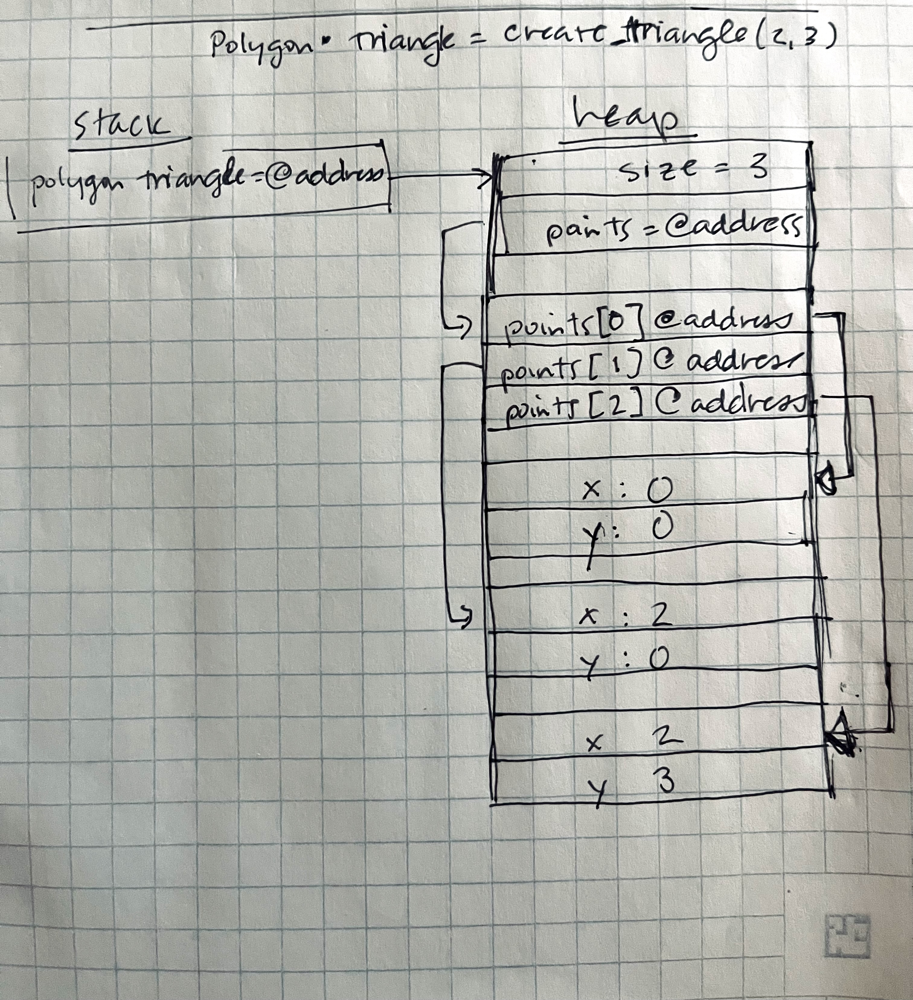

# Homework - C Practice Report

Completely answer the report questions below. Make sure to double check the final version to make sure it is easily readable on your github repository. 


**1. What is the difference between a standard numeric type (int, float, double) and a pointer**  

   Numeric types: 
   - int: an integer
   - float: single-precision floating-point (usually 4 bytes)
   - double: double-precision floating-point (usually 8 bytes)

   Pointer: 
   - A pointer stores the memory address of another variable. 
   
**2. In your test file, we had the following code:**    
   ```c
    int* arr = create_array_of_ints_fib(5);
    int expected[] = {1, 1, 2, 3, 5};
   ```
**Later in the code we only `free(arr)` but not expected. Why is this? What is the difference in where they are stored in memory?**

   `arr` is stored on the heap, which requires its memory to be actively managed. On the other hand, `expected` is stored on the stack so it does not need to be freed. 

**3. What is the difference between the heap and stack when related to memory allocation and management?**

**Stack** allocation refers to memory assignment that happens during function calls. 
   - Memory is allocated in blocks, last in / first out. 
   - Memory allocation is managed automatically and when the function finishes execution, memory is deallocated.
   - It is faster than heap allocation. 
 
**Heap** allocation refers to dynamic memory allocation
   - Heap memory persists for the entire execution of the program. 
   - It is not automatically managed and needs to be managed by the programmer in C. 
   - It is slower than stack memory

**4. Take the following code:**
   ```c
   #include <stdio.h>
   #include <stdlib.h>

   typedef struct {
     int x, y;
   } Point;

   Point * new_point(int x, int y) {
     Point pt = {x, y};
     return &pt;
   }

   int main() {
      Point* point = new_point(10, 10);
      printf("x: %d, y: %d", point->x, point->y);
      return 0;
   }
   ```
**Would the code run correctly? Even if it does compile, what would be some potential runtime issues? After answering your thoughts, put the output of a run below (you may need to run it a few times).**

The code returns the memory address of a local variable, which can become corrupted or point to garbage values. 

   Compiling the code generates the following warning:
   ```text
   report_test.c:10:14: warning: address of stack memory associated with local variable 'pt' returned [-Wreturn-stack-address]
   10 |      return &pt;
   ```

Running the code produces the following output:
   ```text
   x: 10, y: 10%
   ```

**Fix the code in the following block:**   
```c
   #include <stdio.h>
   #include <stdlib.h>

   typedef struct {
     int x, y;
   } Point;

   Point * new_point(int x, int y) {
      Point* point = malloc(sizeof(Point)); 
      point -> x = x;
      point -> y = y;
      return point;

   }

   int main() {
      Point* point = new_point(10, 10);
      printf("x: %d, y: %d", point->x, point->y);
      return 0;
   }
   ```

**5. When you use `malloc`, where are you storing the information?**
   When you use `malloc`, you are storing information on the heap. 

**6.  Speaking about `malloc` and `calloc`, what is the difference between the two (you may need to research it!)?**
    - `malloc` allocates a single memory block on the heap but does not initialize values (garbage values).[3]
    - `calloc` allocates a specified number of memory blocks on the heap with values initialized to 0.[3]
    - Both return a pointer.[3]

**7. What are some common built in libraries used for C, list at least 3 and explain each one in your own words. Name a few (at least 3) functions in those libraries (hint: we used two of the most common ones in this assignment. There are many resources online that tell you functions in each library - you need to include at least 1 reference, but ideally for every library, you should have a reference to it)?**
   - Example: stdlib.h - provides functions for general-purpose operations including
              memory management and random numbers [1].
     - void * malloc(size_t) - allocates memory specified in size on the heap and returns a pointer to that location
     - void * calloc(size_t num_elements, size_t element_size) - contiguous allocation for allocating arrays with the default value of 0. Slower than malloc. 
     - int rand(void) - returns a random integer between 0 and RAND_MAX. Seed should be set before hand. 
*1. stdio.h - provides standard in/ out and file handling[4]*
   * `int printf(const char *format, ...)` - Writes a formatted string to the console
   * `int scanf(const char *format, ...)` - Reads formatted input from stdin.
   * `FILE *fopen(const char *filename, const char *mode)` - Opens the filename pointed to by filename using the given mode.

*2. inttypes.h - tools or formatting and working with numeric data type(int)[5]*
   * `PRIiMAX` - This is printf specifier for intmax_t
   * `SCNxMAX` -  This is scanf specifier for intmax_t (used for reading input)
   * `imaxabs` - abs for intmax_t

*3. assert.h - a library used for assertion tests[6]*
   * `void assert(int expression)` evaluates the expression
   * `void assert(int expression)` - with comma operator, can be used to print a message[7]
   * `static_assert(boolean_expression, message)` runs at compile-time rather than at runtime
 

**8. Looking at the struct Point and Polygon, we have a mix of values on the heap, and we make ample use of pointers. Take a moment to draw out how you think that looks after `create_triangle(2,3)` is called (see an example below). The important part of the drawing it to see that not everything is stored together in memory, but in different locations! Store the image file in your github repo and link it here. You can use any program to draw it such as [drawIO](https://app.diagrams.net/), or even draw it by hand and take a picture of it.**




## Technical Interview Practice Questions
For both these questions, are you are free to use what you did as the last section on the team activities/answered as a group, or you can use a different question.

1. Select one technical interview question (this module or previous) from the [technical interview list](https://github.com/CS5008-khoury/Resources/blob/main/TechInterviewQuestions.md) below and answer it in a few sentences. You can use any resource you like to answer the question.

   **What is the difference between git add and git commit?**
   - `git add` stages changes to be added to the project history. The Staging Area is an intermediate space. After this step, the changes are not yet saved to the project history; they can still be reviewed. 
   - `git commit` saves the staged changes to the project history. Each commit should have a descriptive message. Each commit also has a unique ID--a commit hash-- that can be referenced or reverted later. It also includes the author and date of the commit.


2. Select one coding question (this module or previous) from the [coding practice repository](https://github.com/CS5008-khoury/Resources/blob/main/LeetCodePractice.md) and include a c file with that code with your submission. Make sure to add comments on what you learned, and if you compared your solution with others. 

   See [Pointers in C](pointers_in_c.c)

## Deeper Thinking
**In Java and Python, do you think new objects are stored on the stack or the heap? Feel free to work through your thoughts as to why it would be better to store them on the stack or heap. You should consider pass by reference, and how that is similar to pointer in your answer. Feel free to use resources, but make sure to cite them, and include the citation below using ACM format. You will note LLMs are not valid references, but they can give you directions to valid references. Make sure to use your own words. Answer here using a paragraph (not just bullet points).** 

   In Java and Python, objects are stored on the heap, and memory clean up (garbage collection)[1][2] is managed automatically. Objects are stored on the heap because they need to persist inside and outside of the scope in which they were created. Within a function/method, variables are stored on the stack. Within a function, this makes sense because they can be popped on/off the stack. 


## References
Add any references you use here. Use ACM style formatting, adding to the numbers as you add the reference. 

1. GeeksforGeeks. 2025. How are variables stored in Python - Stack or Heap? GeeksforGeeks. (July 12, 2025). Retrieved September 15, 2025 from https://www.geeksforgeeks.org/python/how-are-variables-stored-in-python-stack-or-heap/

2. DevCookies. Heap vs. Stack Memory in Java: Key Differences Explained! Medium. Retrieved September 15, 2025 from https://devcookies.medium.com/heap-vs-stack-memory-in-java-key-differences-explained-%EF%B8%8F-e6fcc5ea84d4
   
3. GeeksforGeeks. 2025. Difference Between malloc() and calloc() with Examples. GeeksforGeeks. (July 23, 2025). Retrieved September 15, 2025 from https://www.geeksforgeeks.org/c/difference-between-malloc-and-calloc-with-examples/
   
4. Tutorialspoint. C Standard Library - stdio.h. Tutorialspoint. Retrieved September 15, 2025 from https://www.tutorialspoint.com/c_standard_library/stdio_h.htm
   
5. Tutorialspoint. C library - <inttypes.h>. Tutorialspoint. Retrieved September 15, 2025 from https://www.tutorialspoint.com/c_standard_library/c_library_inttypes_h.htm
   
6. GeeksforGeeks. C Library Functions. GeeksforGeeks. Retrieved September 15, 2025 from https://www.geeksforgeeks.org/c/c-library-functions/
   
7. Wikipedia contributors. 2025. Assert.h. Wikipedia, The Free Encyclopedia. Retrieved September 15, 2025 from https://en.wikipedia.org/wiki/Assert.h


## Resource/Help: Linking to images?
To link an image, you use the following code

```markdown

```
for example
```markdown

```


Here is a sample using: 
```c
void my_func() {
    Polygon* r = create_rectangle(5,5);
    printf("The area of the rectangle is %d\n", area(r));
}
```


Note: This is a simplified version. However, it helps illustrate why we need to use `free` on the pointers in the struct. If we do not, we will have memory leaks! (memory that is allocated, but not freed, and thus cannot be used by other programs). In the above example code, `r` is created, and then the variable is destroyed when the function ends. However, the memory allocated for the struct is not freed, and thus we have a memory leak.

When you work on your version for `create_triangle(2, 3)`, you do not have to be exact on the memory structure (the locations on the heap were randomly chosen). The idea is more to show how the memory is stored, and the pointers to different memory addresses. 

